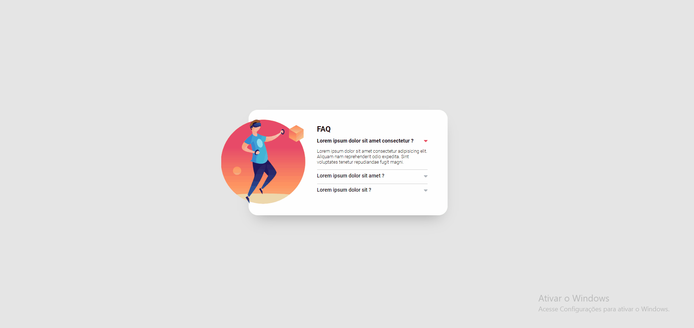
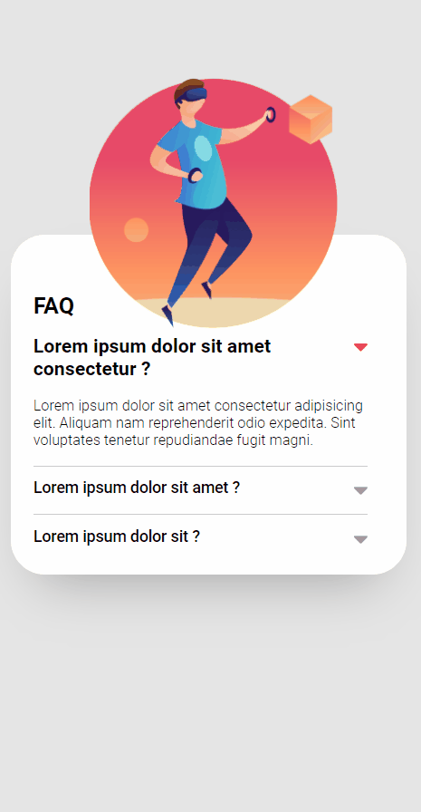

# Efeito Accordion

Desafio realizado no curso DevQuest, no módulo de JavaScript intermediário

### Objetivos

- Visualizar o layout ideal para a página, dependendo do tamanho da tela do dispositivo
- Obtenha acesso às informações de forma flexível, como um "efeito sanfona"

### Linguagens

- HTML
- CSS
- JavaScript

### Layout Desktop

### Layaout Mobile

